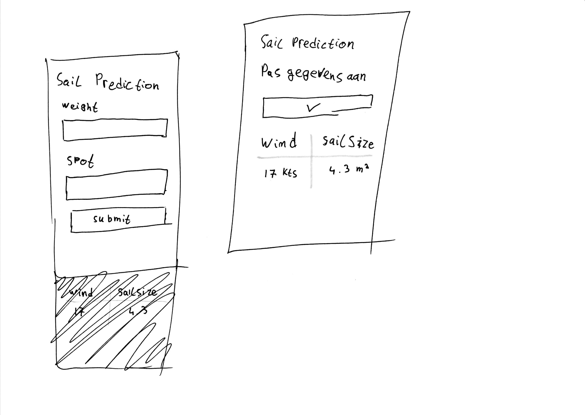
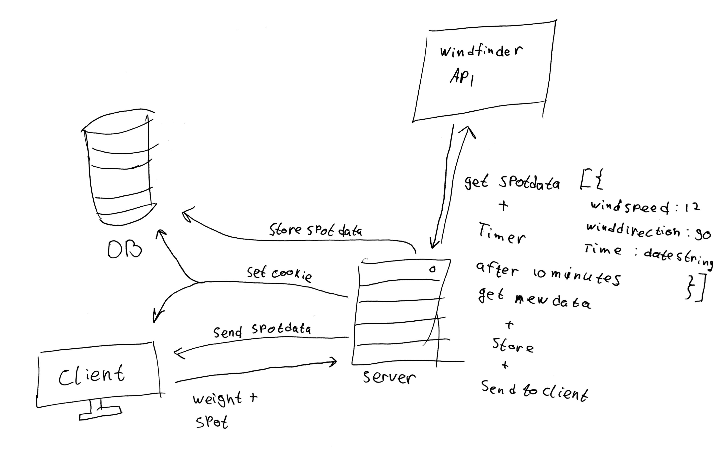
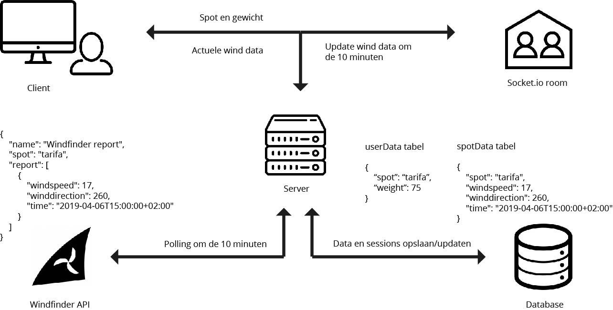

# Real Time Sail Prediction
> Niets is zo veranderlijk als het weer

## Inhoud
* [Concept](#concept)
* [API](#api)
* [Data lifecycle](#data-lifecycle)
* [To do](#to-do)

## Concept
Deze applicatie haalt de actuele windsnelheid op en berekent de zeilgrootte die een windsurfer bij de actuele wind zou moeten optuigen. Geïnspireerd door [dit project](https://github.com/RoryMearns/Windsurf_Calculator).  

Wanneer een gebruiker data aanvraagt van een spot wordt deze data opgeslagen in een SQL database en wordt er een timer gezet om na 10 minuten nieuwe data op te halen en naar de clients te sturen die op dat moment de data van die spot gebruiken, waarna de data in de databse weer wordt geüpdatet. Wanneer een andere gebruiker data voor dezelfde spot opvraagt wordt deze data uit de database opgehaald.

Ook wordt de gebruiker in een socket.io room gestopt met de naam van de spot. Zo kunnen alle gebruikers die dezelfde spot bekijken in een keer van nieuwe informatie worden voorzien.

Simpele schets van het concept

## API
De app gebruikt de windfinder API om actuele winddata op te halen. Dit wordt gedaan met mijn [wind-scrape](https://github.com/jeroentvb/wind-scrape) project omdat de windfinder API niet helemaal publiek is. Het heeft een key nodig die dagelijks verandert.  
Het nadeel van het feit dat het een niet helemaal publieke API is is dat het geen documentatie heeft, en er dus ook geen rate-limit bekend is.  
Dit is een voorbeeld van een API link, deze zal niet werken wanneer je dit leest. [https://api.windfinder.com/v2/spots/nl248/reports/?limit=-1&timespan=last24h&step=1m&customer=wfweb&version=1.0&token=283501578a0ec424ad6a991d64025be1](https://api.windfinder.com/v2/spots/nl248/reports/?limit=-1&timespan=last24h&step=1m&customer=wfweb&version=1.0&token=283501578a0ec424ad6a991d64025be1)

## Data lifecycle

De eerste (getekende) versie van de data lifecycle

## To do
- [ ] Geef de pagina beter vorm
- [ ] Geef de gebruiker feedback als er nieuwe data binnen is
- [ ] Autocomplete mogelijke bestaande spots
